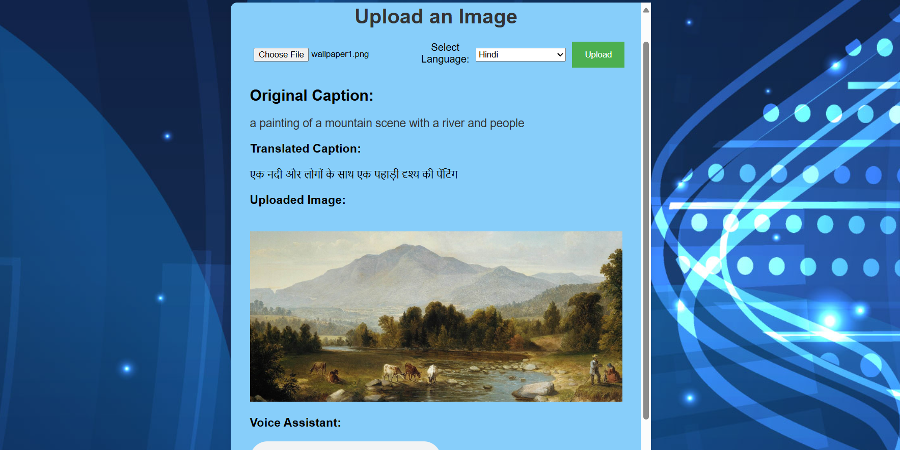

# Image Captioning and Description

This is a Flask-based web application that uses the **BLIP (Bootstrapping Language-Image Pretraining)** model to generate captions and detailed descriptions for uploaded images. The app provides a simple API to upload an image and get both a caption and a detailed description of the image.



## Features

- Upload an image to generate a caption and detailed description.
- Display the generated caption, description, and uploaded image on the webpage.
- Built using **Flask**, **PyTorch**, **Hugging Face Transformers**, and **BLIP** model.
- Easy-to-use web interface for uploading images.

## Requirements

- Python 3.7 or above
- Required Python packages:
    - Flask
    - PyTorch
    - torchvision
    - Hugging Face Transformers
    - Pillow

You can install the dependencies using:

```bash
pip install -r requirements.txt
```

## Project Structure

```
/your-project-folder
├── app.py                # Main Flask backend code
├── /uploads              # Directory for uploaded images
├── /templates
│   └── index.html        # HTML frontend for image upload
├── /static
│   └── /css
│       └── styles.css    # Stylesheet for frontend
└── README.md             # Project documentation
```

## Setup and Running the Application

### Step 1: Clone the Repository

Clone this repository to your local machine:

```bash
git clone https://github.com/Ganesh2409/ImageCaptioningAndDescription.git
cd ImageCaptioningAndDescription
```

### Step 2: Install the Dependencies

Install all the required Python packages listed in the `requirements.txt`:

```bash
pip install -r requirements.txt
```

You can also install the dependencies manually:

```bash
pip install flask torch torchvision transformers Pillow
```

### Step 3: Run the Flask Application

Run the Flask app using the following command:

```bash
python app.py
```

By default, the app will run on `http://127.0.0.1:5000/`.

### Step 4: Access the Web Interface

Open your web browser and navigate to `http://127.0.0.1:5000/`. The homepage will allow you to upload an image. Once you upload an image, it will generate and display the caption and description.

---

## API Functionality

### 1. `GET /`

- **Purpose**: This endpoint serves the HTML page with the image upload form.
- **Response**: A simple HTML page with a file upload form and a submit button.

### 2. `POST /upload`

- **Purpose**: Accepts an image file, processes it, and generates a caption and detailed description.
- **Request**: The image file should be sent as form-data with the key `file`.
    Example:
    ```bash
    curl -X POST -F "file=@path_to_image.jpg" http://127.0.0.1:5000/upload
    ```
- **Response**: A JSON object containing the caption, detailed description, and URL of the uploaded image:
    ```json
    {
        "caption": "A very old temple with a lot of statues",
        "detailed_description": "This image depicts a very old temple with intricate statues of gods and carvings...",
        "image_url": "/uploads/<filename>"
    }
    ```

### 3. `GET /uploads/<filename>`

- **Purpose**: Serves the uploaded image for viewing.
- **Request**: To view an uploaded image, navigate to the URL `http://127.0.0.1:5000/uploads/<filename>`.
    Example: `http://127.0.0.1:5000/uploads/ramappa_wallpaper.jpg`

---

## How It Works

### 1. Uploading the Image

Once a user uploads an image via the web form, the image is saved to the `uploads` directory on the server. The Flask app handles this through the `POST /upload` endpoint.

### 2. Image Preprocessing

After saving the image, it is processed using **BLIPProcessor** from the Hugging Face library. The image is resized and normalized to prepare it for the **BLIP** model. This preprocessing ensures that the image is in the right format for the model to understand and generate captions.

### 3. Caption and Description Generation

- **BLIP** (Bootstrapping Language-Image Pretraining) is a pretrained model for vision-language tasks, including image captioning and generating detailed descriptions.
- The image is passed through the model using `BlipForConditionalGeneration`, and the result is decoded into human-readable text.

### 4. Displaying Results

After the caption and description are generated, the Flask app responds with the caption, detailed description, and a link to the uploaded image. These results are then displayed on the frontend.

---

## Code Walkthrough

### `app.py` (Flask Backend)

- **Flask Setup**: The app is set up with Flask, which routes requests and handles logic for image uploads.
- **Model Loading**: The `BlipProcessor` and `BlipForConditionalGeneration` are loaded to preprocess the image and generate captions and descriptions.
- **Image Upload and Processing**: The `POST /upload` endpoint saves the uploaded image, processes it, and generates a caption and description using BLIP.
- **Serving Images**: The `GET /uploads/<filename>` endpoint serves the image from the `uploads` directory.

### HTML Frontend (`templates/index.html`)

The frontend provides a simple interface with a file upload button and a submit button. After uploading, the generated caption and description, along with the uploaded image, are displayed.

### CSS Styling (`static/css/styles.css`)

The CSS file ensures that the web interface is clean and user-friendly. The file uses Flexbox to center the content and make the upload button prominent.

---

## Challenges Faced

- **Handling File Uploads**: Managing file uploads and ensuring that the files are saved securely was one of the challenges. We used Flask's built-in functionality to handle file uploads and saved them in a specific directory.
- **Performance**: Ensuring that the image is processed and displayed quickly, especially for large images, required optimization and handling of asynchronous tasks.

---

## Next Steps

- **Model Improvement**: Explore using a more advanced model or fine-tuning the BLIP model on a custom dataset to improve the quality of the captions and descriptions.
- **Frontend Enhancement**: Add more interactive elements like a loading spinner while the image is being processed and displayed.
- **Deployment**: Deploy the app on cloud platforms like Heroku or AWS to make it accessible publicly.

---


```
© 2024  Image Captioning and Description. Made with ❤️
```
